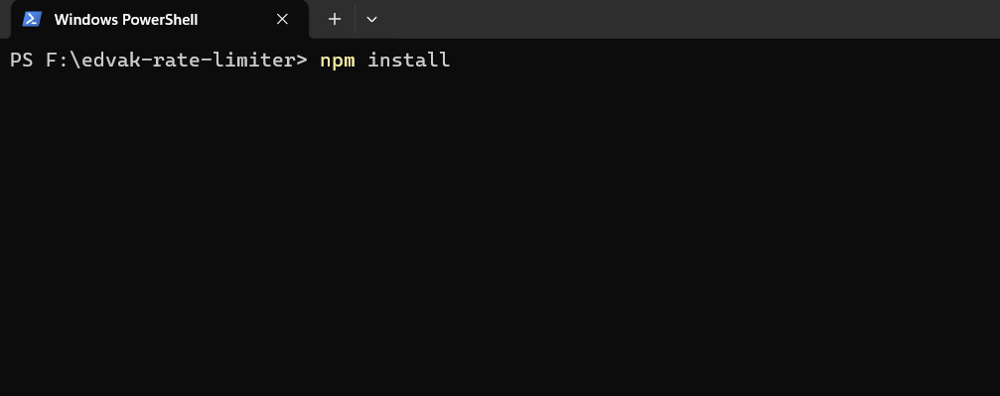

# Edvak Rate Limiter

A scalable rate-limiting solution implemented in a Node.js application to control the number of requests a user or IP address can make within a specified time frame.

## Installation

To get started with the Rate Limiter, follow these steps:

1. **Clone the repository:**

    ```bash
    git clone https://github.com/Praveenkodadala/Edvak-rate-limiter.git
    cd Edvak-rate-limiter

    ```

2. **Install the dependencies:**
   npm install

    


## Usage

To start the server, run the following command:

npm run dev


The server will start and listen on the specified port (default: 3000).

Note: Clusters of Node.js processes can be used to run multiple instances of Node.js that can distribute workloads among their application threads.


## load-testing

Open **another terminal** and run the following command:

npx loadtest http://localhost:3000 -n 1000 -c 10

Or increase the number of requests and concurrent requests:

npx loadtest http://localhost:3000 -n 10000 -c 100

check .env file for RATE_LIMIT (Allow requests per IP) and WINDOW_TIME (Time window in milliseconds )


Now check both terminals; you should see 200 (Ok) and 429(Too Many Requests) status codes.


Once your limit is crossed, you will receive a 409 status code. However, the server will not crash even with thousands of requests.
